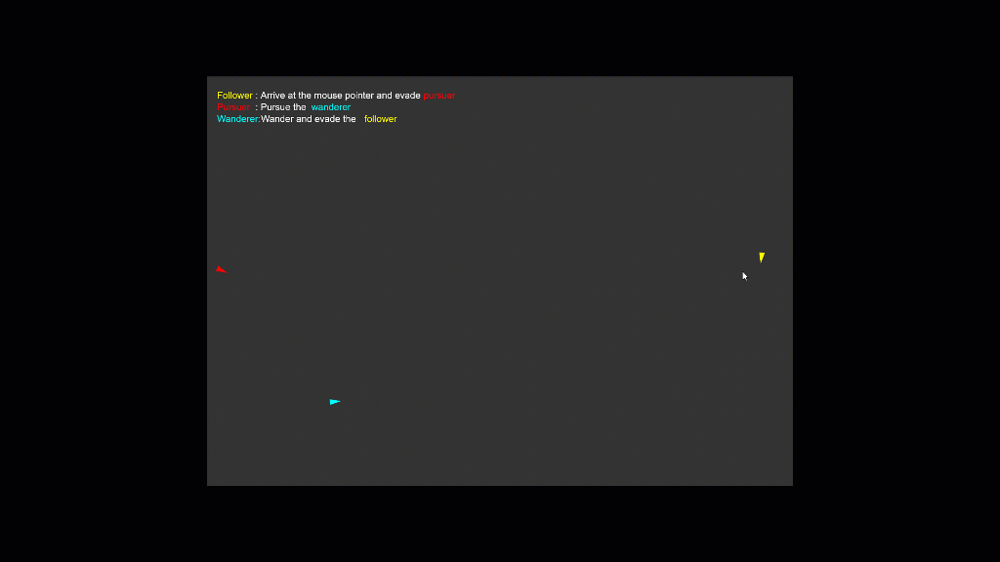

# Steering behaviours
There are three total sketches:
- Flocking behaviour
- Wandering, pursuing and evading behaviour
- Path following behaviour

## How to run locally
- Clone the repository
- Open the `index.html` files of `flocking behaviour`, `wanderer, pursuer and follower`, and `path following` in Mozilla Firefox.

## Flocking behaviour

The flocking behaviour is a combination of three behaviours:
- Alignment: Boids try to align their velocity with the average velocity of their neighbours
- Cohesion: Boids try to move towards the average position of their neighbours
- Separation: Boids try to avoid colliding with their neighbours

## Wandering, pursuing and evading behaviour

- The follower will move towards the mouse and evade the pursuer
- The wanderer will wander and evade the follower
- The pursuer will pursue the wanderer

## Path following behaviour

The boid will target a sequence of points and move towards them. When it reaches a point, it will move towards the next point in the sequence. Thus, path following is acheived.

## Boids
Boids are the triangular creatures moving around the screen. They can do certain behaviours like:
- Wander around the screen
- Pursue another boid (predict where the target boid will be and move towards that point)
- Evade another boid (predict where the target boid will be and move away from that point)
- Flock with other boids (align, cohesion and separation)
- Seek a target (move towards a point)
- Arrive at a target (move towards a point and slow down as it gets closer)
- Follow a path 

 
